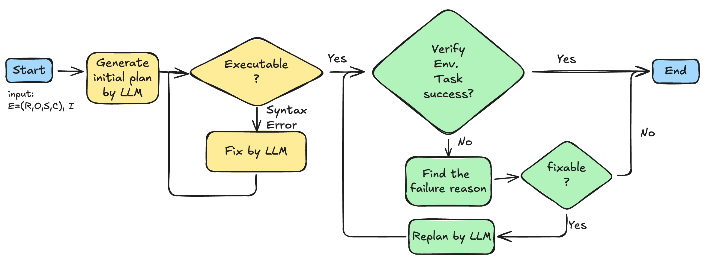

# Enhancing Multi-Agent Robotic Systems with LLM-Driven Coordination
This repository is a course project for the course Win25 CS291I "Introduction to Robotics" at University of California, Santa Barbara.

Chieh-Ying (Jamie) Lai, Sirui Zeng, Xuanhe (Zephyr) Zhou

## Abstract
Multi-Agent Robotic Systems (MAS) provide significant benefits for task execution through distributed co-
ordination. However, they encounter challenges in household environments due to dynamic object interactions
and ambiguous task instructions. Traditional task allocation methods rely on heuristics and optimization
techniques that often fail to adapt to real-time uncertainties. This paper proposes an LLM-driven multi-robot
task planning framework that integrates verification and replanning mechanisms to improve robustness in
execution. Our approach decomposes high-level task instructions into executable subtasks, assigns them
dynamically to agents, and generates structured execution plans. In addition, this paper introduces and
evaluates a verification and replanning mechanism designed to address execution failures, enhancing task
success rates in dynamic environments. Experimental results within the AI2-THOR simulation environment
demonstrate a 30% improvement in task success rate compared to SmartLLM, particularly in complex task
scenarios. Our findings highlight the potential of LLMs in adaptive task coordination, while also addressing
key challenges such as hallucination tendencies and environmental variable interpretation. Future work aims
to further refine real-time adaptability and explore broader multi-agent coordination strategies.





## Setup
Create a conda environment (or virtualenv):
```
conda create -n smartllm python==3.9
```

Install dependencies:
```
pip install -r requirments.txt
```

## Creating LLM API Key

### For OpenAI
The code relies on OpenAI API. Create an API Key at https://platform.openai.com/.

Create a file named ```api_key.txt``` in the root folder of the project and paste your OpenAI Key in the file. 

<!-- ### for DeepSeek
The code relies on DeepSeek API. Create an API Key at https://deepseek.com/apikey.

Create a file named ```deepseek_api_key.txt``` in the root folder of the project and paste your DeepSeek Key in the file. 

### for Gemini
The code relies on Gemini API. Create an API Key at https://ai.google.dev/gemini-api/docs/quickstart.

Create a file named ```gemini_api_key.txt``` in the root folder of the project and paste your Gemini Key in the file. 

### for Llama
The code relies on Llama API. Create an API Key at https://llama.com/api.

Create a file named ```llama_api_key.txt``` in the root folder of the project and paste your Llama Key in the file.  -->


## Quick Start
Run the following command to run the code. This will generate the plan, execute the plan, and verify the plan. The generated files will be stored in the ```logs``` folder. 

```
python3 scripts/ai2thorCorr_main.py
```

## Running Script
### generate the plan
Run the following command to generate output execuate python scripts to perform the tasks in the given AI2Thor floor plans. 

Refer to https://ai2thor.allenai.org/demo for the layout of various AI2Thor floor plans.
```
python3 scripts/{run_llm.py} --floor-plan {floor_plan_no}
```
Note: Refer to the script for running it on different versions of GPT models and changing the test dataset. 

The above script should generate the executable code and store it in the ```logs``` folder.

### generate the executable code 
Run the following script to execute the above generated scripts and execute it in an AI2THOR environment. 

The script requires command which needs to be executed as parameter. ```command``` needs to be the folder name in the ```logs``` folder where the executable plans generated are stored. 
```
python3 scripts/execute_plan.py --command {command}
```

### run the executable code 
Find the corresponding executable code ```executable_plan.py``` in  ```\logs\*\```.

For example: 
```
python logs/_Turn_on_Sink_faucet_and_put_toilet_paper_in_the_trash_plans_gpt_gpt-4_03-01-2025-13-56-32/executable_plan.py
```
Once you run the executable code, you suppose to get a ```environment_states.json``` file.

### replan

**TBD** Not yet implement. (replan using LLM and prev_stat of environment)

Generate an updated code in ```logs/{task}/code_replan.py```.

```
python scripts/replan.py --command {}
```

Run the following script to execute the above generated scripts and execute it in an AI2THOR environment. 

The script requires command which needs to be executed as parameter. ```command``` needs to be the folder name in the ```logs``` folder where the executable plans generated are stored. 
```
python3 scripts/execute_plan.py --command {command} --replan
```

Finally, rerun the executable code.
For example: 
```
python logs/_Turn_on_Sink_faucet_and_put_toilet_paper_in_the_trash_plans_gpt_gpt-4_03-01-2025-13-56-32/executable_plan.py
```

### Verify the result

The result of execution is stored in the ```environment_states.json``` file. You can verify the result by running the following script to check if the task is completed. ```command``` needs to be the folder name in the ```logs``` folder where the executable plans generated are stored. 

```
python scripts/verify.py --command {command}
```
or 
```
python scripts/verify_llm.py --command {command}
```


